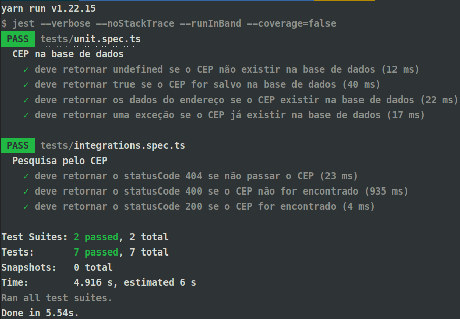

<h1 align="center">Projeto ViaCEP - API REST</h1>

<h2 align="center">
    API REST que realiza consulta à API ViaCEP e retorna os dados do endereço
</h2>

 

    
    
    

 

    <a href="#goal">Objetivo</a> •
    <a href="#technologies">Tecnologias</a> •
    <a href="#features">Features</a> •
    <a href="#features">Instruções</a> •
    <a href="#author">Autor</a>

 

<h2 id="goal">🎯️ Objetivo</h2>

 

    O objetivo dessa API é buscar o CEP informado pelo usuário e guardá-lo localmente para futuras buscas com o intuito de otimizar as requisições feitas pela aplicação web.

 

<h2 id="features">💻️ Features</h2>

 

- [x] Busca pelo CEP na API da [ViaCEP](https://viacep.com.br/)
- [x] Cache do CEP buscado em uma base de dados local

 

<h2 id="technologies">🛠 Tecnologias</h2>

 

As seguintes ferramentas foram usadas no desenvolvimento do projeto:

- [NodeJS](https://nodejs.org/en/)
- [TypeScript](https://www.typescriptlang.org/)
- [Express](https://expressjs.com/pt-br/)
- [TypeORM](https://typeorm.io/#/)
- [SQLite](https://www.sqlite.org/index.html)
- [ESLint](https://eslint.org/)
- [Prettier](https://prettier.io/)
- [Jest](https://jestjs.io/pt-BR/)

 

<h2 id="features">🗒️ Instruções</h2>

 

<h3>Para rodar o projeto siga as instruções abaixo:</h3>

**1.** Clonar esse repositório em um local de sua preferência

**2.** Instalar as depedências do projeto com o **npm** (comando `npm install`) ou com **yarn** (comando `yarn`)

**3.** Execute o comando `yarn typeorm -- migration:run` ou `npm run typeorm -- migration:run` para criar a tabela onde o CEP ficará armazenado.

**4.** Execute o comando `yarn start` ou `npm start` para subir o servidor.

**5.** Pronto. O servidor estará disponível na url **http://localhost:8080**.

 

<h2 id="features">🗒️ Testes</h2>

 

Foram aplicados 7 testes nessa API, sendo 4 de unidade e 3 de integração:

**Testes de unidade**

- Verificar se quando o CEP não está armazenado na base de dados a resposta é `undefined`.
- Verificar se o CEP é armazenado na base de dados.
- Verificar se quando o CEP está armazenado na base de dados a resposta contem os dados do mesmo.
- Verificar se o CEP não é armazenado mais de uma vez na base de dados.

**Testes de integração**

- Verificar se ocorre falha se o CEP não é passado na pesquisa.
- Verificar se ocorre falha se o CEP não for encontrado.
- Verificar se ocorre sucesso se CEP for encontrado.

 

    

 

<h2 id="author">✏️️ Autor</h2>

 

<a>
    
     
    <strong>Lucas Santos</strong>
</a>

 

Get in touch!

